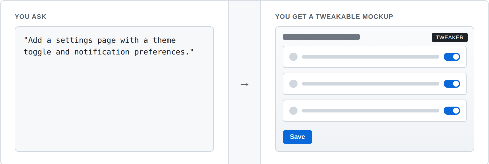
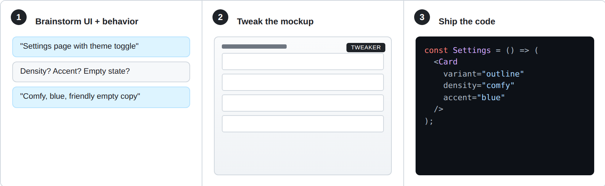

<div align="center">

# design-skills

**Stop fixing the UI in PR review.**
A design loop for Claude Code, Codex, and Gemini CLI.

  



</div>

- **One mockup, every variant.** The tweaker panel exposes every design knob ("less padding", "softer accent", "different copy"), so you compare alternatives in seconds — no regeneration, no PR-comment round-trips.
- **The Design System is the contract.** Approved mockups become DS files. Implementation references them. Visual QA checks the live page against the same file.

## Quickstart

Install design-skills in Claude Code:

```bash
claude plugin marketplace add alkg-cloud/design-skills
claude plugin install design-skills
```

Restart Claude Code. Then ask your agent to design or build any feature with a visible UI — the `design-feature` skill takes over.

Pin a tag with `alkg-cloud/design-skills@v0.6.1`.

<details>
<summary><b>Codex CLI</b></summary>

```md
Use skill-installer to install `design-feature` and `bootstrap-design-system` from https://github.com/alkg-cloud/design-skills
```

</details>

<details>
<summary><b>Gemini CLI</b></summary>

```bash
gemini extensions install alkg-cloud/design-skills
```

</details>

<details>
<summary><b>Other harnesses (OpenCode, Cursor, Copilot CLI, …)</b></summary>

Each `SKILL.md` is plain Markdown with YAML frontmatter. Drop it wherever your harness loads skills. The cross-harness tool reference at the top of each `SKILL.md` covers Claude Code, Gemini CLI, and Codex CLI explicitly; for others, the model translates using your harness's own docs.

</details>

## How it works



**1. Brainstorm the UI, not just the code.**
The skill runs a design-only conversation: what variants, what densities, what empty states, what error states. It produces a self-contained HTML mockup with a tweaker panel inlined — every meaningful decision becomes a knob.

**2. Iterate by tweaking, not regenerating.**
You flip variants, density, accent, copy directly on the mockup. The skill hosts it via [Markup](https://markup.alego.cloud) (comments, version history, DS components navigation) when configured, or falls back to the superpowers visual-companion for a quick view without that overhead. When you approve, locked choices get baked into a Design System file under `docs/design/design-system/`.

**3. Implement against the DS file. QA against the DS file.**
A technical brainstorm + plan + execute follows, with DS edits as first-class tasks. After implementation, the skill drives Chrome to compare the live route to the DS file's state matrix and reports drift until parity (or a documented exception).

→ [See the full 6-phase workflow](docs/workflow.md)

## The two skills

**[`design-feature`](./skills/design-feature/SKILL.md)** — Use when designing or building any feature with a visible UI. Drives the full design loop above. This is the primary entry point.

**[`bootstrap-design-system`](./skills/bootstrap-design-system/SKILL.md)** — Use once on existing projects that already have shipped code. Extracts a draft Design System from the running UI so the design loop has a starting point.

<details>
<summary><b>Stack and dependencies</b></summary>

design-skills orchestrates two existing skill plugins and one external service. It refuses to run without the two hard dependencies; soft dependencies degrade to manual flows.

### Hard dependencies

- **[superpowers](https://github.com/obra/superpowers)** — provides `brainstorming`, `writing-plans`, `subagent-driven-development`, and the visual-companion fallback.
  - Claude Code: `claude plugin install obra/superpowers`
  - Gemini CLI: `gemini extensions install obra/superpowers`
  - Codex CLI: `/plugins` → search `superpowers` → Install Plugin
- **[frontend-design](https://github.com/anthropics/claude-code/tree/main/plugins/frontend-design)** — Anthropic's official skill for the mockup generation, shipped via the `claude-code-plugins` marketplace.
  - Claude Code: `claude plugin marketplace add anthropics/claude-code && claude plugin install frontend-design@claude-code-plugins`
  - Other harnesses: drop `plugins/frontend-design/skills/frontend-design/SKILL.md` into the harness's skill directory.

### Soft dependencies (degrade gracefully)

- **[Markup](https://markup.alego.cloud)** instance — hosted mockups + comment iteration + DS components navigation. Without `MARKUP_URL`/`MARKUP_TOKEN`, the skill walks the user through manual equivalents and uses the superpowers visual-companion as a lightweight viewer (no comments, no history, no DS navigation). See `skills/design-feature/scripts/README.md` for the full env-var contract.
- **Chrome MCP** — required for Phase 5 visual QA and `bootstrap-design-system`'s snapshot step.
  - Claude Code: install [Claude for Chrome](https://chromewebstore.google.com/detail/claude/fcoeoabgfenejglbffodgkkbkcdhcgfn) and launch with `claude --chrome` (or `/chrome` in-session). Requires Claude Code 2.0.73+; Chrome or Edge.
  - Fallback (any harness): `claude mcp add chrome-devtools npx chrome-devtools-mcp@latest`, `gemini mcp add chrome-devtools npx chrome-devtools-mcp@latest`, or `codex mcp add chrome-devtools -- npx chrome-devtools-mcp@latest`.

### Compatibility

Each skill declares its minimum supported Markup server version in `SKILL.md` frontmatter (`compat.markup`). At startup the skill invokes `./scripts/doctor.sh` (Unix) / `pwsh ./scripts/doctor.ps1` (Windows) to check Markup reachability and version; out-of-date servers degrade with a warning so offline flows remain available.

| design-skills tag | Min Markup server |
|---|---|
| v0.6.1 | 0.2.0 |

</details>

## Contributing

Validate skills before sending a PR:

```bash
node validate.mjs
# or: npm test
```

The validator checks frontmatter shape (including `compat.markup` semver ranges), body content, script invocation references, and that bundled templates are present.

## License

MIT
