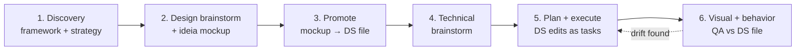

# README redesign — Implementation Plan

> **For agentic workers:** REQUIRED SUB-SKILL: Use superpowers:subagent-driven-development (recommended) or superpowers:executing-plans to implement this plan task-by-task. Steps use checkbox (`- [ ]`) syntax for tracking.

**Goal:** Rewrite `README.md` to the structure approved in `docs/superpowers/specs/2026-05-26-readme-redesign-design.md`: hero with one before/after PNG, three problem-first value bullets, compact install, narrative "How it works" with a 3-panel diagram PNG, two-skills paragraphs, and collapsed deps. Extract the current 6-phase workflow into `docs/workflow.md` with a Mermaid flowchart. Bump plugin to 0.6.1.

**Architecture:** Two static PNG assets produced from version-controlled HTML sources under `docs/img-src/` and rendered via headless Chromium (Puppeteer, installed transiently with `--no-save`). README and `docs/workflow.md` are plain Markdown. Plugin metadata updates are mechanical. No skill or validator code changes.

**Tech Stack:** Markdown, HTML/CSS (GitHub-native palette), Mermaid (GitHub-rendered), Puppeteer (transient install for asset rendering only), Node.js ≥20.

---

## File map

**Create:**
- `docs/img-src/render.mjs` — Puppeteer-based renderer (HTML → PNG @2x)
- `docs/img-src/hero-before-after.html` — source for Section 1 hero (Visual A)
- `docs/img-src/how-it-works.html` — source for Section 4 diagram (Diagram D)
- `docs/img-src/README.md` — short note explaining the render workflow
- `docs/img/hero-before-after.png` — rendered hero asset (binary)
- `docs/img/how-it-works.png` — rendered diagram asset (binary)
- `docs/workflow.md` — extracted 6-phase workflow + Mermaid flowchart

**Modify:**
- `README.md` — full rewrite per spec
- `.claude-plugin/plugin.json` — version `0.6.0` → `0.6.1`

**Do not touch:**
- `skills/**` — no skill changes
- `validate.mjs`, `scripts/**` — no tooling changes
- `package.json` — Puppeteer is installed transiently with `--no-save`, must not be added as a dependency
- `.gitignore` — already updated in `d58dbfb` (the spec commit) to exclude `.superpowers/`

---

## Pre-flight: verify environment

- [ ] **Verify Node.js ≥20**

Run: `node --version`
Expected: `v20.x.x` or newer. If older, install Node 20+ before proceeding.

- [ ] **Verify clean working tree on main**

Run: `git status`
Expected: `nothing to commit, working tree clean` on branch `main`. If dirty, stop and check with the user.

- [ ] **Verify `.gitignore` includes `.superpowers/`**

Run: `grep '^\.superpowers/$' .gitignore`
Expected: `.superpowers/` on its own line. If missing, the spec commit `d58dbfb` is incomplete — stop and investigate.

---

## Task 1: Render infrastructure

**Files:**
- Create: `docs/img-src/render.mjs`
- Create: `docs/img-src/README.md`

- [ ] **Step 1: Create `docs/img-src/render.mjs`**

```javascript
// docs/img-src/render.mjs
// One-shot renderer for README image assets.
//
// Usage:
//   cd <repo root>
//   npm install --no-save puppeteer    # downloads Chromium (~170MB, one-time)
//   node docs/img-src/render.mjs       # writes PNGs into docs/img/
//
// Each entry in SOURCES corresponds to one HTML source -> one PNG output.
// Renders at deviceScaleFactor 2 so the PNG is retina-quality.

import puppeteer from 'puppeteer';
import { fileURLToPath } from 'node:url';
import { dirname, resolve } from 'node:path';
import { existsSync, mkdirSync } from 'node:fs';

const __dirname = dirname(fileURLToPath(import.meta.url));
const OUT_DIR = resolve(__dirname, '../img');
mkdirSync(OUT_DIR, { recursive: true });

const SOURCES = [
  { html: 'hero-before-after.html', png: 'hero-before-after.png', width: 830, height: 280 },
  { html: 'how-it-works.html',      png: 'how-it-works.png',      width: 840, height: 260 },
];

const browser = await puppeteer.launch({ args: ['--no-sandbox'] });
try {
  for (const s of SOURCES) {
    const srcPath = resolve(__dirname, s.html);
    if (!existsSync(srcPath)) {
      console.warn(`skipped ${s.html} (source not found)`);
      continue;
    }
    const page = await browser.newPage();
    await page.setViewport({ width: s.width, height: s.height, deviceScaleFactor: 2 });
    await page.goto('file://' + srcPath, { waitUntil: 'networkidle0' });
    const outPath = resolve(OUT_DIR, s.png);
    await page.screenshot({ path: outPath, omitBackground: false });
    console.log(`wrote ${outPath}`);
    await page.close();
  }
} finally {
  await browser.close();
}
```

- [ ] **Step 2: Create `docs/img-src/README.md`**

````markdown
# Image asset sources

This directory holds the HTML source files for the visual assets used in
the project README. Each source renders to a single PNG in `../img/`.

## Editing an asset

1. Edit the relevant `.html` file (open in browser to preview).
2. Re-render:

   ```bash
   # From repo root, first time only:
   npm install --no-save puppeteer

   node docs/img-src/render.mjs
   ```

3. Commit both the `.html` change and the regenerated `.png`.

## Output dimensions

| Source                       | PNG output                  | Display size |
|------------------------------|-----------------------------|--------------|
| `hero-before-after.html`     | `../img/hero-before-after.png` | 830×280  |
| `how-it-works.html`          | `../img/how-it-works.png`      | 840×260  |

PNGs are rendered at deviceScaleFactor 2 (so the actual pixel dimensions
are double the table above) for retina-quality display on GitHub.
````

- [ ] **Step 3: Smoke-test the renderer with a throwaway HTML**

Create `docs/img-src/_smoke.html`:

```html
<!DOCTYPE html>
<html><body style="margin:0;background:#0969da;color:white;font:bold 48px sans-serif;display:flex;align-items:center;justify-content:center;height:100vh">RENDER OK</body></html>
```

**Temporarily** replace the entire `SOURCES` array in `render.mjs` with **only** the smoke entry (so the renderer doesn't try to open the two real sources that don't exist yet):

```javascript
const SOURCES = [
  { html: '_smoke.html', png: '_smoke.png', width: 400, height: 200 },
];
```

Then run:

```bash
npm install --no-save puppeteer
node docs/img-src/render.mjs
```

Expected stdout (1 line):
```
wrote /workspace/projects/design-skills/docs/img/_smoke.png
```

Verify the smoke PNG was written and is non-empty:

```bash
file docs/img/_smoke.png
```

Expected: `docs/img/_smoke.png: PNG image data, 800 x 400, 8-bit/color RGBA, non-interlaced`
(Width and height are 2× the source dimensions due to deviceScaleFactor 2.)

**Troubleshooting:** if Puppeteer launches but `page.goto` errors with a missing-library error (e.g., `error while loading shared libraries: libnss3.so`), the bundled Chromium needs system deps. On Debian/Ubuntu:

```bash
sudo apt-get install -y libnss3 libgbm1 libasound2 libatk-bridge2.0-0 libdrm2 libxkbcommon0
```

Re-run the smoke command. If the error persists, ask the user before proceeding — alternative paths (system chromium, playwright with --with-deps) exist but require sudo.

- [ ] **Step 4: Clean up the smoke test**

```bash
rm docs/img-src/_smoke.html docs/img/_smoke.png
```

**Restore** the `SOURCES` array in `render.mjs` to the two real entries from Step 1:

```javascript
const SOURCES = [
  { html: 'hero-before-after.html', png: 'hero-before-after.png', width: 830, height: 280 },
  { html: 'how-it-works.html',      png: 'how-it-works.png',      width: 840, height: 260 },
];
```

- [ ] **Step 5: Commit**

```bash
git add docs/img-src/render.mjs docs/img-src/README.md
git commit -m "docs(img): add Puppeteer-based render script for asset sources"
```

---

## Task 2: Hero visual — `hero-before-after`

**Files:**
- Create: `docs/img-src/hero-before-after.html`
- Create: `docs/img/hero-before-after.png` (binary, output of render)

Reference draft: the option-A card in `.superpowers/brainstorm/1461595-1779769133/content/hero-options.html` (lines containing `<!-- OPTION A: Before/After split -->` through the closing `</div>` of that card). Use it as a starting point, but strip the card/selection wrappers and tighten dimensions.

- [ ] **Step 1: Write `docs/img-src/hero-before-after.html`**

```html
<!DOCTYPE html>
<html lang="en">
<head>
<meta charset="utf-8">
<title>hero-before-after</title>
<style>
  html, body { margin: 0; padding: 0; background: #fff; }
  body {
    font-family: -apple-system, BlinkMacSystemFont, "Segoe UI", Helvetica, Arial, sans-serif;
    color: #1f2328;
  }
  .frame {
    width: 830px;
    height: 280px;
    box-sizing: border-box;
    padding: 0;
    background: #fff;
  }
  .split {
    display: grid;
    grid-template-columns: 1fr 56px 1fr;
    height: 100%;
    border: 1px solid #d0d7de;
    border-radius: 8px;
    overflow: hidden;
  }
  .side { padding: 22px 24px; background: #fff; display: flex; flex-direction: column; }
  .label {
    font-size: 11px;
    text-transform: uppercase;
    color: #59636e;
    letter-spacing: 0.6px;
    margin-bottom: 10px;
    font-weight: 600;
  }
  .prompt {
    font-family: ui-monospace, SFMono-Regular, Menlo, monospace;
    font-size: 13px;
    background: #f6f8fa;
    border: 1px solid #d0d7de;
    border-radius: 6px;
    padding: 14px;
    color: #1f2328;
    line-height: 1.55;
    flex: 1;
  }
  .arrow {
    display: flex;
    align-items: center;
    justify-content: center;
    background: #f6f8fa;
    color: #59636e;
    font-size: 22px;
    border-left: 1px solid #d0d7de;
    border-right: 1px solid #d0d7de;
  }
  .mockup {
    flex: 1;
    background: linear-gradient(180deg, #fafbfc 0%, #f0f3f6 100%);
    border: 1px solid #d0d7de;
    border-radius: 6px;
    padding: 12px;
    position: relative;
  }
  .mockup .topbar { height: 10px; background: #6e7681; border-radius: 3px; margin-bottom: 10px; width: 42%; }
  .mockup .row {
    background: white;
    border: 1px solid #d0d7de;
    border-radius: 4px;
    height: 36px;
    margin-bottom: 8px;
    display: flex;
    align-items: center;
    padding: 0 10px;
    gap: 8px;
  }
  .mockup .row .dot { width: 14px; height: 14px; border-radius: 50%; background: #d0d7de; }
  .mockup .row .bar { height: 6px; background: #d0d7de; border-radius: 2px; flex: 1; }
  .mockup .row .toggle { width: 28px; height: 14px; background: #0969da; border-radius: 7px; position: relative; }
  .mockup .row .toggle::after { content: ''; position: absolute; right: 2px; top: 2px; width: 10px; height: 10px; border-radius: 50%; background: white; }
  .mockup .btn {
    background: #0969da;
    color: white;
    font-size: 11px;
    font-weight: 600;
    padding: 6px 12px;
    border-radius: 5px;
    display: inline-block;
    margin-top: 6px;
  }
  .tweaker {
    position: absolute;
    top: 10px;
    right: 10px;
    background: #1f2328;
    color: white;
    font-size: 9px;
    padding: 3px 7px;
    border-radius: 3px;
    letter-spacing: 0.4px;
    text-transform: uppercase;
  }
</style>
</head>
<body>
  <div class="frame">
    <div class="split">
      <div class="side">
        <div class="label">You ask</div>
        <div class="prompt">"Add a settings page with a theme toggle and notification preferences."</div>
      </div>
      <div class="arrow">→</div>
      <div class="side">
        <div class="label">You get a tweakable mockup</div>
        <div class="mockup">
          <div class="tweaker">tweaker</div>
          <div class="topbar"></div>
          <div class="row"><span class="dot"></span><span class="bar"></span><span class="toggle"></span></div>
          <div class="row"><span class="dot"></span><span class="bar"></span><span class="toggle"></span></div>
          <div class="row"><span class="dot"></span><span class="bar"></span><span class="toggle"></span></div>
          <span class="btn">Save</span>
        </div>
      </div>
    </div>
  </div>
</body>
</html>
```

- [ ] **Step 2: Render**

Run: `node docs/img-src/render.mjs`

Expected stdout (two lines, in order):
```
wrote /workspace/projects/design-skills/docs/img/hero-before-after.png
skipped how-it-works.html (source not found)
```

The skip is expected — `how-it-works.html` is created in Task 3.

- [ ] **Step 3: Verify the PNG**

Run: `file docs/img/hero-before-after.png`

Expected: `docs/img/hero-before-after.png: PNG image data, 1660 x 560, 8-bit/color RGBA, non-interlaced`

(Width and height are 2× the 830×280 source viewport due to deviceScaleFactor 2.)

- [ ] **Step 4: Visual inspection**

Open the PNG in an image viewer or via a quick HTTP server. Confirm:
- Left panel shows the monospace prompt about a settings page
- Right panel shows the mockup with a visible `tweaker` badge in the corner
- An arrow separates the two
- No clipping, no overflow, no missing text

If anything is off, edit the `.html`, re-render, and re-verify before committing.

- [ ] **Step 5: Commit**

```bash
git add docs/img-src/hero-before-after.html docs/img/hero-before-after.png
git commit -m "docs(img): add hero before/after asset for README rewrite"
```

---

## Task 3: Diagram D — `how-it-works`

**Files:**
- Create: `docs/img-src/how-it-works.html`
- Create: `docs/img/how-it-works.png` (binary, output of render)

Reference draft: the option-D card in `.superpowers/brainstorm/1461595-1779769133/content/hero-options.html` (lines containing `<!-- OPTION D: 3-panel composite -->` through the closing `</div>` of that card).

- [ ] **Step 1: Write `docs/img-src/how-it-works.html`**

```html
<!DOCTYPE html>
<html lang="en">
<head>
<meta charset="utf-8">
<title>how-it-works</title>
<style>
  html, body { margin: 0; padding: 0; background: #fff; }
  body { font-family: -apple-system, BlinkMacSystemFont, "Segoe UI", Helvetica, Arial, sans-serif; color: #1f2328; }
  .frame {
    width: 840px;
    height: 260px;
    border: 1px solid #d0d7de;
    border-radius: 8px;
    overflow: hidden;
    background: #fff;
    display: grid;
    grid-template-columns: 1fr 1fr 1fr;
  }
  .panel {
    padding: 18px 16px 16px 16px;
    border-right: 1px solid #d0d7de;
    background: #fff;
    position: relative;
    display: flex;
    flex-direction: column;
  }
  .panel:last-child { border-right: none; }
  .step {
    position: absolute;
    top: 12px;
    left: 14px;
    background: #1f2328;
    color: white;
    width: 22px;
    height: 22px;
    border-radius: 50%;
    display: flex;
    align-items: center;
    justify-content: center;
    font-size: 12px;
    font-weight: 600;
  }
  .title {
    font-size: 12px;
    font-weight: 600;
    margin: 4px 0 12px 32px;
    color: #1f2328;
    line-height: 1.3;
  }
  .body { flex: 1; display: flex; flex-direction: column; gap: 6px; }
  .bubble {
    background: #f6f8fa;
    border: 1px solid #d0d7de;
    border-radius: 6px;
    padding: 6px 10px;
    font-size: 11px;
    color: #1f2328;
    line-height: 1.4;
  }
  .bubble.user { background: #ddf4ff; border-color: #b6e3ff; }
  .mockup {
    flex: 1;
    background: linear-gradient(180deg, #fafbfc 0%, #f0f3f6 100%);
    border: 1px solid #d0d7de;
    border-radius: 6px;
    padding: 10px;
    position: relative;
  }
  .mockup .topbar { height: 6px; background: #6e7681; border-radius: 2px; margin-bottom: 6px; width: 40%; }
  .mockup .row { background: white; border: 1px solid #d0d7de; border-radius: 3px; height: 22px; margin-bottom: 5px; }
  .mockup .tweaker {
    position: absolute;
    top: 8px;
    right: 8px;
    background: #1f2328;
    color: white;
    font-size: 8px;
    padding: 2px 6px;
    border-radius: 3px;
    letter-spacing: 0.3px;
    text-transform: uppercase;
  }
  .code {
    flex: 1;
    background: #0d1117;
    color: #adbac7;
    font-family: ui-monospace, SFMono-Regular, Menlo, monospace;
    font-size: 11px;
    padding: 12px;
    border-radius: 6px;
    line-height: 1.5;
  }
  .code .kw  { color: #ff7b72; }
  .code .str { color: #a5d6ff; }
  .code .fn  { color: #d2a8ff; }
</style>
</head>
<body>
<div class="frame">

  <div class="panel">
    <div class="step">1</div>
    <div class="title">Brainstorm UI + behavior</div>
    <div class="body">
      <div class="bubble user">"Settings page with theme toggle"</div>
      <div class="bubble">Density? Accent? Empty state?</div>
      <div class="bubble user">"Comfy, blue, friendly empty copy"</div>
    </div>
  </div>

  <div class="panel">
    <div class="step">2</div>
    <div class="title">Tweak the mockup</div>
    <div class="body">
      <div class="mockup">
        <div class="tweaker">tweaker</div>
        <div class="topbar"></div>
        <div class="row"></div>
        <div class="row"></div>
        <div class="row"></div>
        <div class="row"></div>
      </div>
    </div>
  </div>

  <div class="panel">
    <div class="step">3</div>
    <div class="title">Ship the code</div>
    <div class="body">
      <div class="code">
<span class="kw">const</span> <span class="fn">Settings</span> = () =&gt; (<br>
&nbsp;&nbsp;&lt;<span class="fn">Card</span><br>
&nbsp;&nbsp;&nbsp;&nbsp;variant=<span class="str">"outline"</span><br>
&nbsp;&nbsp;&nbsp;&nbsp;density=<span class="str">"comfy"</span><br>
&nbsp;&nbsp;&nbsp;&nbsp;accent=<span class="str">"blue"</span><br>
&nbsp;&nbsp;/&gt;<br>
);
      </div>
    </div>
  </div>

</div>
</body>
</html>
```

- [ ] **Step 2: Render**

Run: `node docs/img-src/render.mjs`

Expected stdout (both succeed now):
```
wrote /workspace/projects/design-skills/docs/img/hero-before-after.png
wrote /workspace/projects/design-skills/docs/img/how-it-works.png
```

- [ ] **Step 3: Verify the PNG**

Run: `file docs/img/how-it-works.png`

Expected: `docs/img/how-it-works.png: PNG image data, 1680 x 520, 8-bit/color RGBA, non-interlaced`

- [ ] **Step 4: Visual inspection**

Confirm three equal panels, each with:
- A black numbered circle in the top-left (1/2/3)
- A title
- Distinct content (chat bubbles / mini-mockup with tweaker badge / code snippet)

Borders between panels visible, no clipping, code snippet readable.

- [ ] **Step 5: Commit**

```bash
git add docs/img-src/how-it-works.html docs/img/how-it-works.png
git commit -m "docs(img): add 'how it works' 3-panel diagram for README rewrite"
```

---

## Task 4: Extract `docs/workflow.md`

**Files:**
- Create: `docs/workflow.md`

This task lifts content from the current `README.md` sections `## How it works` and `## The 6-phase workflow` (lines 11-26 and 103-112 in the current file) into a dedicated doc, adds a Mermaid flowchart of the 6 phases, and leaves the README free to use the new tone.

- [ ] **Step 1: Read current README sections to extract**

Run: `sed -n '11,26p;103,112p' README.md`

Keep the output in scratchpad — Step 2 reuses the prose nearly verbatim.

- [ ] **Step 2: Write `docs/workflow.md`**

````markdown
# The design-feature workflow

`design-feature` runs a 6-phase loop. Each phase has a gate that writes
`.markup-design/scratch/<slug>/state.json` so the workflow resumes
cleanly after a context reset.



## The 6 phases

1. **Discovery + framework + strategy.** Detect `package.json`, agent
   guidelines, project docs. Present a framework-aware strategy menu.
   Persist to `.markup-design/scratch/strategy.json`. Greenfield projects
   get a separate manual-pick prompt.

2. **Design brainstorm + ideia mockup.** `brainstorming` (FASTPATH) +
   `frontend-design`. Mockup gets the bundled tweaker panel. Iterates
   via Markup comments or the superpowers visual-companion. Gate: user
   approves + pastes tweaker JSON.

3. **Promote.** Bake locked tweaker choices into the mockup, strip the
   tweaker scaffolding, reformat into a DS file under
   `docs/design/design-system/`. Gate: `./scripts/promote.sh` exits 0
   (DS file written + server upload confirmed).

4. **Technical brainstorm.** `brainstorming` scoped to implementation,
   seeded with the DS files affected and the target code. Gate: tech
   spec approved + branch is not main/master.

5. **Plan + execute.** `writing-plans` (DS edits as first-class tasks) +
   `subagent-driven-development`. Gate: tests pass +
   `verification-before-completion` invoked + any DS edits re-validated.

6. **Visual + behavior QA.** Chrome MCP opens the live route + DS file
   side-by-side. Scenarios derive from the DS file's State decision
   matrix. Gate: zero drift or a documented exception.

## Strategy detection

The skill detects the framework + ecosystem of the project (React +
antd + react-hook-form, Vue + Vuetify, jQuery + Bootstrap, …) and asks
which strategy to use for the "Code API" of every component. That
choice is persisted and binding for the rest of the feature.

## DS file as contract

When you approve a mockup, the skill promotes it into a canonical DS
file under `docs/design/design-system/`, baking the locked choices as
attributes/CSS-vars and reformatting the file to a pattern that
includes a State decision matrix and a Code API section adapted to your
strategy. Phase 5 implements against that file. Phase 6 QAs against the
same file.

## Resuming after a context reset

If a session ends mid-loop, the skill resumes from
`.markup-design/scratch/<slug>/state.json` after a context reset. The
gate that wrote the most recent state.json determines where the next
session picks up.

## Bootstrapping projects with shipped code

For projects that already have shipped code, the
[`bootstrap-design-system`](./skills/bootstrap-design-system/SKILL.md)
skill extracts a draft DS from the running UI before the design loop
begins. It is a one-shot — once the DS exists, the design loop takes
over.
````

- [ ] **Step 3: Verify Mermaid syntax is valid**

The Mermaid block must parse cleanly on GitHub. Quick local validation
without installing a CLI:

```bash
node -e "
const fs = require('fs');
const md = fs.readFileSync('docs/workflow.md', 'utf8');
const block = md.match(/\`\`\`mermaid\n([\s\S]+?)\n\`\`\`/);
if (!block) { console.error('no mermaid block found'); process.exit(1); }
const body = block[1];
if (!body.startsWith('flowchart')) { console.error('expected flowchart prefix'); process.exit(1); }
const lines = body.split('\n').filter(l => l.trim() && !l.trim().startsWith('%%'));
const arrowLines = lines.filter(l => /-->|-.->|-.[a-z|]+\|.*\|->/.test(l));
if (arrowLines.length < 5) { console.error('expected at least 5 edges, got', arrowLines.length); process.exit(1); }
console.log('mermaid block looks structurally OK:', arrowLines.length, 'edges');
"
```

Expected output: `mermaid block looks structurally OK: 6 edges`

(Full Mermaid parse would need `@mermaid-js/mermaid-cli` — skipping that here. The plan's final verification opens GitHub to confirm rendering.)

- [ ] **Step 4: Commit**

```bash
git add docs/workflow.md
git commit -m "docs: extract 6-phase workflow into docs/workflow.md with Mermaid flowchart"
```

---

## Task 5: Rewrite `README.md`

**Files:**
- Modify: `README.md` (full replacement)

This task replaces the entire README with the spec-approved structure. The source of truth for copy is `docs/superpowers/specs/2026-05-26-readme-redesign-design.md` — re-read it before writing.

- [ ] **Step 1: Re-read the spec to confirm copy**

Run: `cat docs/superpowers/specs/2026-05-26-readme-redesign-design.md`

Pay attention to: tagline, 3 value bullets, 3 How-it-works paragraphs, install commands, Stack section structure.

- [ ] **Step 2: Replace `README.md` with the new content**

Overwrite `README.md` with exactly this content:

````markdown
<div align="center">

# design-skills

**Stop fixing the UI in PR review.**
A design loop for Claude Code, Codex, and Gemini CLI.

  


</div>

- **Catch UI decisions in design, not in review.** "Less padding", "softer accent", "different copy" — those round-trips belong in a mockup, not a PR comment.
- **One mockup, every variant.** The tweaker panel exposes every design knob, so you compare alternatives in seconds — no regeneration required.
- **The Design System is the contract.** Approved mockups become DS files. Implementation references them. Visual QA checks the live page against the same file.

## Quickstart

Install design-skills in Claude Code:

```bash
claude plugin marketplace add AlexandreCamillo/design-skills
claude plugin install design-skills
```

Restart Claude Code. Then ask your agent to design or build any feature with a visible UI — the `design-feature` skill takes over.

Pin a tag with `AlexandreCamillo/design-skills@v0.6.1`.

<details>
<summary><b>Codex CLI</b></summary>

```md
Use skill-installer to install `design-feature` and `bootstrap-design-system` from https://github.com/AlexandreCamillo/design-skills
```

</details>

<details>
<summary><b>Gemini CLI</b></summary>

```bash
gemini extensions install AlexandreCamillo/design-skills
```

</details>

<details>
<summary><b>Other harnesses (OpenCode, Cursor, Copilot CLI, …)</b></summary>

Each `SKILL.md` is plain Markdown with YAML frontmatter. Drop it wherever your harness loads skills. The cross-harness tool reference at the top of each `SKILL.md` covers Claude Code, Gemini CLI, and Codex CLI explicitly; for others, the model translates using your harness's own docs.

</details>

## How it works


**1. Brainstorm the UI, not just the code.**
The skill runs a design-only conversation: what variants, what densities, what empty states, what error states. It produces a self-contained HTML mockup with a tweaker panel inlined — every meaningful decision becomes a knob.

**2. Iterate by tweaking, not regenerating.**
You flip variants, density, accent, copy directly on the mockup. The skill hosts it via [Markup](https://markup.alego.cloud) (comments, version history, DS components navigation) when configured, or falls back to the superpowers visual-companion for a quick view without that overhead. When you approve, locked choices get baked into a Design System file under `docs/design/design-system/`.

**3. Implement against the DS file. QA against the DS file.**
A technical brainstorm + plan + execute follows, with DS edits as first-class tasks. After implementation, the skill drives Chrome to compare the live route to the DS file's state matrix and reports drift until parity (or a documented exception).

→ [See the full 6-phase workflow](docs/workflow.md)

## The two skills

**[`design-feature`](./skills/design-feature/SKILL.md)** — Use when designing or building any feature with a visible UI. Drives the full design loop above. This is the primary entry point.

**[`bootstrap-design-system`](./skills/bootstrap-design-system/SKILL.md)** — Use once on existing projects that already have shipped code. Extracts a draft Design System from the running UI so the design loop has a starting point.

<details>
<summary><b>Stack and dependencies</b></summary>

design-skills orchestrates two existing skill plugins and one external service. It refuses to run without the two hard dependencies; soft dependencies degrade to manual flows.

### Hard dependencies

- **[superpowers](https://github.com/obra/superpowers)** — provides `brainstorming`, `writing-plans`, `subagent-driven-development`, and the visual-companion fallback.
  - Claude Code: `claude plugin install obra/superpowers`
  - Gemini CLI: `gemini extensions install obra/superpowers`
  - Codex CLI: `/plugins` → search `superpowers` → Install Plugin
- **[frontend-design](https://github.com/anthropics/claude-code/tree/main/plugins/frontend-design)** — Anthropic's official skill for the mockup generation, shipped via the `claude-code-plugins` marketplace.
  - Claude Code: `claude plugin marketplace add anthropics/claude-code && claude plugin install frontend-design@claude-code-plugins`
  - Other harnesses: drop `plugins/frontend-design/skills/frontend-design/SKILL.md` into the harness's skill directory.

### Soft dependencies (degrade gracefully)

- **[Markup](https://markup.alego.cloud)** instance — hosted mockups + comment iteration + DS components navigation. Without `MARKUP_URL`/`MARKUP_TOKEN`, the skill walks the user through manual equivalents and uses the superpowers visual-companion as a lightweight viewer (no comments, no history, no DS navigation). See `skills/design-feature/scripts/README.md` for the full env-var contract.
- **Chrome MCP** — required for Phase 5 visual QA and `bootstrap-design-system`'s snapshot step.
  - Claude Code: install [Claude for Chrome](https://chromewebstore.google.com/detail/claude/fcoeoabgfenejglbffodgkkbkcdhcgfn) and launch with `claude --chrome` (or `/chrome` in-session). Requires Claude Code 2.0.73+; Chrome or Edge.
  - Fallback (any harness): `claude mcp add chrome-devtools npx chrome-devtools-mcp@latest`, `gemini mcp add chrome-devtools npx chrome-devtools-mcp@latest`, or `codex mcp add chrome-devtools -- npx chrome-devtools-mcp@latest`.

### Compatibility

Each skill declares its minimum supported Markup server version in `SKILL.md` frontmatter (`compat.markup`). At startup the skill invokes `./scripts/doctor.sh` (Unix) / `pwsh ./scripts/doctor.ps1` (Windows) to check Markup reachability and version; out-of-date servers degrade with a warning so offline flows remain available.

| design-skills tag | Min Markup server |
|---|---|
| v0.6.1 | 0.2.0 |

</details>

## Contributing

Validate skills before sending a PR:

```bash
node validate.mjs
# or: npm test
```

The validator checks frontmatter shape (including `compat.markup` semver ranges), body content, script invocation references, and that bundled templates are present.

## License

MIT
````

- [ ] **Step 3: Verify the new README structurally**

Run: `wc -w README.md`

Expected: between 600 and 900 words (target ~700 per spec). If outside this range, investigate before committing — copy may have drifted from the spec.

Run these checks:

```bash
grep -c '^## ' README.md          # expected: 5 (Quickstart, How it works, The two skills, Contributing, License)
grep -c '^### ' README.md         # expected: 0 (everything else nested inside <details>)
grep -c 'docs/img/hero-before-after.png' README.md   # expected: 1
grep -c 'docs/img/how-it-works.png' README.md        # expected: 1
grep -c 'docs/workflow.md' README.md                 # expected: 1
grep -c '<details>' README.md                        # expected: 4
# Value bullets are the only 3 lines starting with "- **" that are NOT indented inside <details>:
awk '/<details>/{d=1} /<\/details>/{d=0; next} !d && /^- \*\*/' README.md | wc -l   # expected: 3
```

Any mismatch means a section is missing or duplicated — re-read Step 2 against the file.

- [ ] **Step 4: Verify Markdown renders cleanly**

If `markdownlint` is installed, run `markdownlint README.md`. Otherwise, open `README.md` in any markdown-aware editor (VS Code, GitHub web preview) and visually confirm:
- Hero centered, two-line tagline, three badges
- Hero PNG renders
- Three bullets, bold lead-ins
- Quickstart code block under Claude Code
- Three `<details>` blocks under Quickstart (Codex, Gemini, Other)
- "How it works" PNG renders above the three numbered paragraphs
- One `<details>` block ("Stack and dependencies") later
- Compatibility table inside that `<details>`

- [ ] **Step 5: Commit**

```bash
git add README.md
git commit -m "docs(readme): rewrite to problem-first hero + compact install + collapsed deps"
```

---

## Task 6: Version bump to 0.6.1

**Files:**
- Modify: `.claude-plugin/plugin.json` (line containing `"version": "0.6.0"`)

The README badge already reads `v0.6.1` from Task 5. The compatibility table inside the README also already shows `v0.6.1`. This task only updates the canonical metadata in `plugin.json`.

- [ ] **Step 1: Confirm current version**

Run: `grep '"version"' .claude-plugin/plugin.json`

Expected: `  "version": "0.6.0",`

- [ ] **Step 2: Bump to 0.6.1**

Edit `.claude-plugin/plugin.json`. Change exactly this line:

From:
```json
  "version": "0.6.0",
```
To:
```json
  "version": "0.6.1",
```

- [ ] **Step 3: Verify the change**

Run: `grep '"version"' .claude-plugin/plugin.json`

Expected: `  "version": "0.6.1",`

- [ ] **Step 4: Check for other version references that should be in sync**

Run:

```bash
grep -rn '0\.6\.0' \
  --include='*.md' --include='*.json' --include='*.yaml' --include='*.yml' \
  --exclude-dir=node_modules --exclude-dir=.git \
  --exclude-dir=.superpowers --exclude-dir=.worktrees \
  . \
  | grep -vE '(^|/)CHANGELOG\.md:|/docs/superpowers/(specs|plans)/'
```

Expected: zero lines of output. Specs and plans intentionally reference past versions; CHANGELOG is historical record.

If any other file matches, evaluate whether it should be bumped:
- A marketplace entry at the repo root or in `.claude-plugin/marketplace.json` — yes, bump (memory `feedback_plugin_version_bump`).
- Skill frontmatter `version:` fields in `skills/*/SKILL.md` — bump if individual skills are versioned independently.
- Anything else — likely fine; ask the user if unsure.

- [ ] **Step 5: Run validator**

Run: `node validate.mjs`

Expected: exit code 0, no errors. Any failure is a real issue — fix before committing.

- [ ] **Step 6: Commit**

```bash
git add .claude-plugin/plugin.json
git commit -m "chore: bump plugin version to 0.6.1 for README rewrite"
```

---

## Task 7: Final verification

This task gates the work as ready to push. No code changes; all checks.

- [ ] **Step 1: Full validator + smoke**

Run: `npm test`

Expected: exits 0. (`npm test` runs `node validate.mjs && node scripts/smoke-test.mjs`.)

- [ ] **Step 2: Spec coverage check**

Re-read `docs/superpowers/specs/2026-05-26-readme-redesign-design.md`. For each row in the "Target structure" table, confirm the README has the section. For each item under "Migration plan → Delete from current README", confirm it's gone. For each "Add", confirm it's present.

Quick automated cross-check:

```bash
grep -c '^# design-skills' README.md             # 1: name still present
grep -c 'Stop fixing the UI in PR review' README.md   # 1: tagline
grep -cE '^- \*\*' README.md                     # 3: value bullets (bold lead-in pattern)
grep -c 'Quickstart' README.md                   # 1
grep -c 'How it works' README.md                 # 1
grep -c 'The two skills' README.md               # 1
grep -c 'Stack and dependencies' README.md       # 1
test -f docs/workflow.md && echo OK              # OK
test -f docs/img/hero-before-after.png && echo OK # OK
test -f docs/img/how-it-works.png && echo OK     # OK
```

Any mismatch is a real gap — re-open the relevant task.

- [ ] **Step 3: Confirm old sections are removed**

```bash
grep -c '## The 6-phase workflow' README.md      # 0 (moved to docs/workflow.md)
grep -c '## What.s inside' README.md             # 0 (replaced by "The two skills")
grep -c 'Browser automation setup' README.md     # 0 (folded into Stack)
```

Each must be 0.

- [ ] **Step 4: Visual rendering check**

Push the branch to a remote (or use `gh repo view` if appropriate), then open the README on GitHub. Confirm:
- Both PNGs render
- Mermaid flowchart in `docs/workflow.md` renders (Mermaid is GitHub-native, no plugin needed)
- All `<details>` blocks expand correctly
- All internal links work (`./skills/design-feature/SKILL.md`, `./skills/bootstrap-design-system/SKILL.md`, `docs/workflow.md`)
- Badges render

If GitHub render isn't available in the execution environment, document the deferred manual check in the handoff message.

- [ ] **Step 5: Clean up transient install**

If `node_modules/` was created by `npm install --no-save puppeteer` and is large enough to interfere with subsequent work, remove it:

```bash
rm -rf node_modules
```

`package.json` was untouched (because of `--no-save`); this is safe.

- [ ] **Step 6: Confirm git log**

Run: `git log --oneline -8`

Expected sequence (top to bottom, most recent first):
```
<sha> chore: bump plugin version to 0.6.1 for README rewrite
<sha> docs(readme): rewrite to problem-first hero + compact install + collapsed deps
<sha> docs: extract 6-phase workflow into docs/workflow.md with Mermaid flowchart
<sha> docs(img): add 'how it works' 3-panel diagram for README rewrite
<sha> docs(img): add hero before/after asset for README rewrite
<sha> docs(img): add Puppeteer-based render script for asset sources
<sha> docs: add README redesign spec (problem-first voice, Continue-style structure)
<sha> docs: remove superpowers audit/SP-N plan archive
```

If commit order is shuffled (e.g., the README rewrite committed before the assets it references), the README on GitHub will show broken images at intermediate SHAs. Acceptable on a feature branch; not acceptable on `main`.

---

## Done

When all tasks pass, the README has been replaced and the plugin is at 0.6.1. The visual companion server from the brainstorm session can be stopped (the Cloudflare tunnel + headless server will idle out after 30 minutes regardless).
