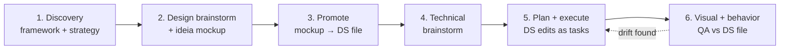

# The design-feature workflow

`design-feature` runs a 6-phase loop. Each phase has a gate that writes
`.markup-design/scratch/<slug>/state.json` so the workflow resumes
cleanly after a context reset.

## The 6 phases

1. **Discovery + framework + strategy.** Detect `package.json`, agent
   guidelines, project docs. Present a framework-aware strategy menu.
   Persist to `.markup-design/scratch/strategy.json`. Greenfield projects
   get a separate manual-pick prompt.

2. **Design brainstorm + ideia mockup.** `brainstorming` (FASTPATH) +
   `frontend-design`. Mockup gets the bundled tweaker panel. Iterates
   via Markup comments or the superpowers visual-companion. Gate: user
   approves + pastes tweaker JSON.

3. **Promote.** Bake locked tweaker choices into the mockup, strip the
   tweaker scaffolding, reformat into a DS file under
   `docs/design/design-system/`. Gate: `./scripts/promote.sh` exits 0
   (DS file written + server upload confirmed).

4. **Technical brainstorm.** `brainstorming` scoped to implementation,
   seeded with the DS files affected and the target code. Gate: tech
   spec approved + branch is not main/master.

5. **Plan + execute.** `writing-plans` (DS edits as first-class tasks) +
   `subagent-driven-development`. Gate: tests pass +
   `verification-before-completion` invoked + any DS edits re-validated.

6. **Visual + behavior QA.** Chrome MCP opens the live route + DS file
   side-by-side. Scenarios derive from the DS file's State decision
   matrix. Gate: zero drift or a documented exception.

## Strategy detection

The skill detects the framework + ecosystem of the project (React +
antd + react-hook-form, Vue + Vuetify, jQuery + Bootstrap, …) and asks
which strategy to use for the "Code API" of every component. That
choice is persisted and binding for the rest of the feature.

## DS file as contract

When you approve a mockup, the skill promotes it into a canonical DS
file under `docs/design/design-system/`, baking the locked choices as
attributes/CSS-vars and reformatting the file to a pattern that
includes a State decision matrix and a Code API section adapted to your
strategy. Phase 5 implements against that file. Phase 6 QAs against the
same file.

## Resuming after a context reset

If a session ends mid-loop, the skill resumes from
`.markup-design/scratch/<slug>/state.json` after a context reset. The
gate that wrote the most recent state.json determines where the next
session picks up.

## Bootstrapping projects with shipped code

For projects that already have shipped code, the
[`bootstrap-design-system`](./skills/bootstrap-design-system/SKILL.md)
skill extracts a draft DS from the running UI before the design loop
begins. It is a one-shot — once the DS exists, the design loop takes
over.
